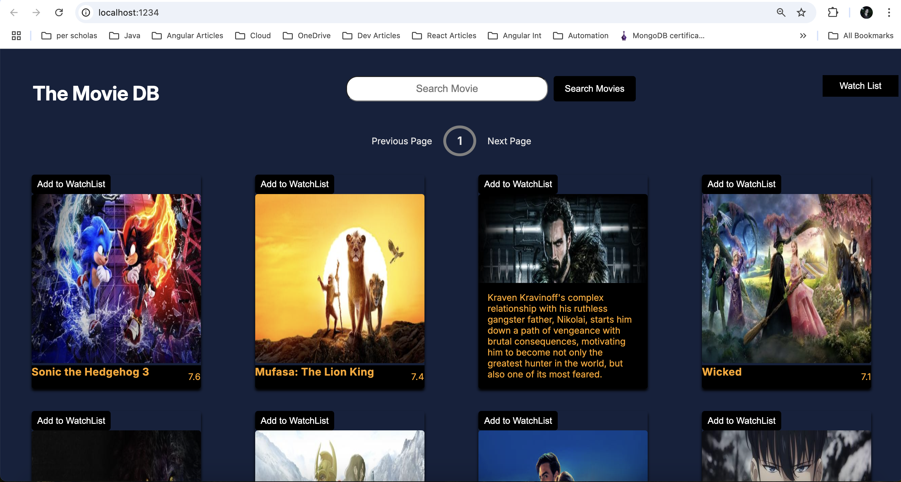

# SBA 308A: JavaScript Web Application

## Objectives

- Use asynchronous JavaScript tools to build a responsive web application.
- Demonstrate understanding of the JavaScript event loop.
- Generate asynchronous code using Promises and async/await syntax.
- Use fetch and/or Axios to interact with an external web API.
- Organize files using modules and imports.

## Technologies Used

- HTML
- CSS
- Javascript

## Features

- MovieDB app displays list of movies now playing by using axios to fetch data.
- Each movie is displayed as a card with movie backdrop, title, rating, movie description that pops on hovering over the movie title and a Add to watchList button to add movies to watchlist.
- Pagination is implemented in the app using next,previous and current.
- A Search button to search movies that get displayed if data exists.
- On click of Add to Watchlist button movie gets added to watch list using POST request.
- To display list of movies from watch list user has to click on WatchList.
- Used imports and exports syntax.

## Output

